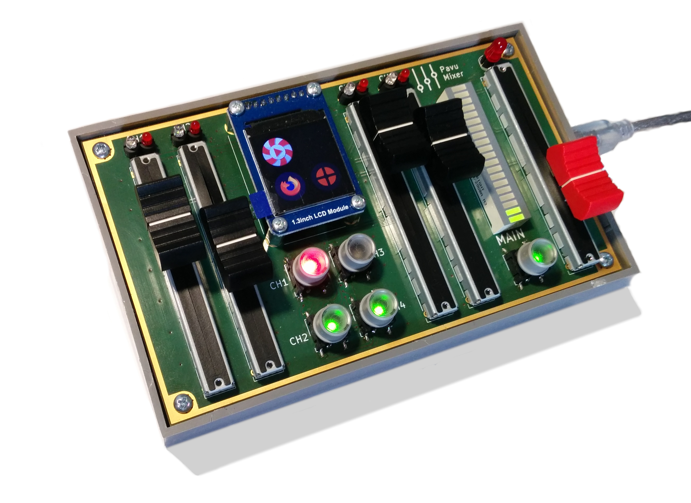

 Pavu Mixer
=================================
_Pavu Mixer_ is a hardware mixing desk for controlling
[PulseAudio](https://www.freedesktop.org/wiki/Software/PulseAudio/) streams on
a connected computer.  Think of it as a hardware version of
[`pavucontrol`](https://freedesktop.org/software/pulseaudio/pavucontrol/).

More pictures in [`Eyecandy/`](./Eyecandy).

### Hardware
The _Pavu Mixer_ is currently just a PCB fitted as the front plate of a
[console enclosure][enclosure].  This remedies the need for a custom front
plate.  Beneath it, an [STM32F3DISCOVERY][discovery] eval board is used as the
controller.  Connection to the computer is done over USB.

Following are the capabilities of the current hardware:

- 4 "Application Channels" + 1 "Main" Channel
- [240x240 LCD Display][display-board] (driver available in
  [`waveshare-display/`](./waveshare-display) subdirectory)
- Per channel:
  - Mono Volume Fader
  - Mute Button with green/red indicator LED
  - LED as brightness-based level indicator
  - Red LED as status indicator
- For the main channel, the level indicator is a 20 segment LED-bargraph
  instead.
- USB-B socket for connection to the computer

[enclosure]: https://www.tekoenclosures.com/en/products/family/PU/series/pult-36
[discovery]: https://www.st.com/en/evaluation-tools/stm32f3discovery.html
[display-board]: https://www.waveshare.com/wiki/1.3inch_LCD_Module

### Firmware/Software
The firmware on the [STM32F3DISCOVERY][discovery] board exposes all of the "UI"
(faders, buttons, indicators, display) to the host via a custom USB class.
Messages are serialized using [`postcard`](https://crates.io/crates/postcard).

On the host, a daemon is running which communicates to the hardware and keeps
track of PulseAudio state.  It has a configuration file for selecting which
channel controls which applications.  Streams are then attached to the mixer
channels automatically when they appear.

The firmware and host-side software are still in development - these features
are subject to change.

- New application streams are attached to channels based on a configurable
  property-matching table.  All streams connected to a channel will be forced
  to the volume reported by the fader.
- Main channel controls the currently selected default sink.
- Whenever a channel has an active stream, its reported icon will be displayed
  on the LCD.  For streams which do not properly report an icon, a second
  matching table can be used to select custom icons.

### Alternative Hardware
Right now, only the _Pavu Mixer_ hardware is supported.  As this board is not
commercially available, but a hardware mixer for PulseAudio could be
interesting for other people as well, I am open to extend the host-daemon to
support other boards as well.  For example, there are a lot of MIDI-based
digital audio mixers which would be a good candidate for support.  Please open
an issue on GitHub or contact me directly if interested.

## Project Structure
| Path | Contents |
| -- | -- |
| `Eyecandy/` | Pictures and "rendered" schematic ([`Pavu-Mixer-Schematic.pdf`](Eyecandy/Pavu-Mixer-Schematic.pdf)). |
| `Hardware/` | KiCAD project for the interface board & other hardware related files. |
| `hardware-tests/` | Test-firmware for demonstrating functionality of all parts of the hardware. |
| `common/` | Definitions shared between firmware and host-software (for [`postcard`](https://crates.io/crates/postcard) serdes). |
| `firmware/` | Firmware for the [STM32F3DISCOVERY][discovery] board. |
| `host-daemon/` | Host-side daemon for mixer communication and PulseAudio interaction. |
| `waveshare-display/` | Driver for the LCD screen (see its [README](waveshare-display/README.md) for details). |

## License
It is a difficult story... Individual parts of this project are licensed under
different terms:

- All files in the `Hardware/` directory (exception below) are licensed under
  the [CERN-OHL-W](LICENSE-HARDWARE).
- Files in `Hardware/3D` are licensed under [MIT](Hardware/3D/LICENSE-3D).
- The display driver in `waveshare-display/` is dual licensed under Apache 2/MIT
  as detailed in its own [README](waveshare-display/README.md).
- The remaining files of this project (including `common/`, `firmware/`,
  `hardware-tests/`, and `host-daemon/`) are licensed under the
  [GPL v3](LICENSE-SOFTWARE).

## Contribution
Unless you explicitly state otherwise, any contribution intentionally submitted
for inclusion in the work by you, as defined in the Apache-2.0 license, shall
be licensed as above, without any additional terms or conditions.
